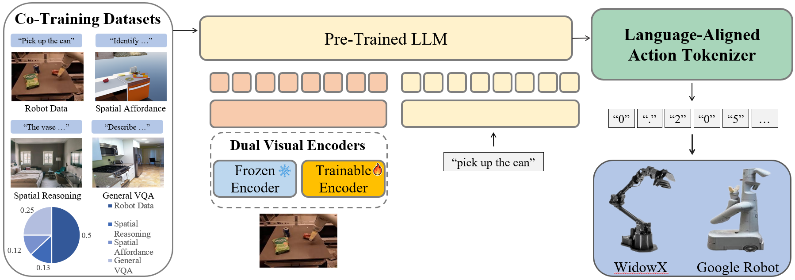
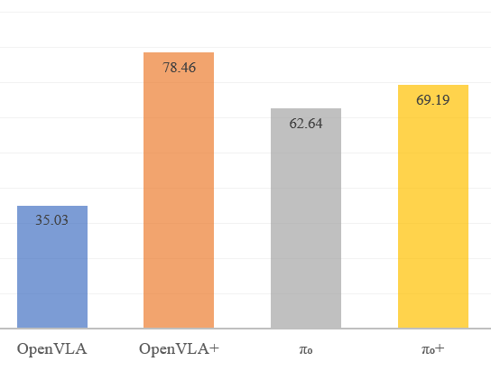
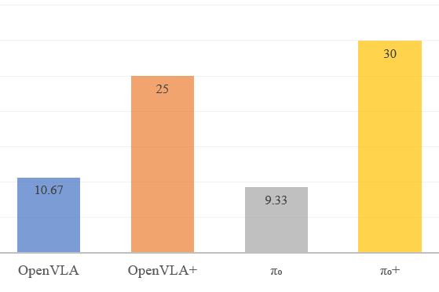

# Enhancing Generalization in Vision-Language-Action Models by Preserving Pretrained Representations

[](https://gen-vla.github.io/)
[](https://arxiv.org/abs/2509.11417)
[](https://huggingface.co/shrg7/openvla-7b)

**Shresth Grover<sup>1\*</sup>, Akshay Gopalkrishnan<sup>1\*</sup>, Bo Ai<sup>1</sup>, Henrik I. Christensen<sup>1</sup>, Hao Su<sup>1,2</sup>, Xuanlin Li<sup>2</sup>**

<sup>1</sup>UC San Diego, <sup>2</sup>Hillbot
<sup>*</sup>Equal contribution

## 📆 Updates

<!--  **September 28, 2025**: Created the repository and released the OpenVLA+ HuggingFace model! Check it out [here](https://huggingface.co/shrg7/openvla-7b). Training and code to be released soon. -->
## 🧠 Method


Our framework is built on **three key ideas** to prevent representation degradation:

1. **Partially-Frozen Visual Encoders**  
   We use two encoders—one **frozen** to preserve robust, pretrained VLM features and one **trainable** to adapt to the specific robot task.

2. **String-Based Action Tokenizer**  
   We represent continuous robot actions as **strings**, unifying them with the **text-based pretraining** of the language model.

3. **Co-Training Strategy**  
   We mix **robot demonstration data** with **vision-language datasets** emphasizing spatial reasoning.  
   This prevents the model from **overfitting to robot-specific data** and enhances its **generalization capabilities**.


## 📈 Results Overview
<p align="center">
  
  
</p>
> *Plots illustrating performance improvements of OpenVLA+ and π₀+ across the two benchmarks.*

We evaluate our models on two benchmarks: SimplerEnv and Real eval

Across both settings, our models — **OpenVLA+** and **π₀+** — consistently outperform their respective baselines.  
In **Simpler Eval**, our design choices (dual encoder, string tokenizer, co-training) yield up to **40% improvement** over baseline VLAs.  
In **Real Eval**, **π₀+** achieves a **success rate of 30**, marking a **three-fold improvement** over its baseline.  

These results demonstrate that our **data and architectural strategies** substantially enhance **generalization** and **robustness**, enabling reliable task execution even under real-world variability.


## 📝 Citation

```bibtex
@article{grover2025enhancing,
  title={Enhancing Generalization in Vision-Language-Action Models by Preserving Pretrained Representations},
  author={Grover, Shresth and Gopalkrishnan, Akshay and Ai, Bo and Christensen, Henrik I and Su, Hao and Li, Xuanlin},
  journal={arXiv preprint arXiv:2509.11417},
  year={2025}
}
```
