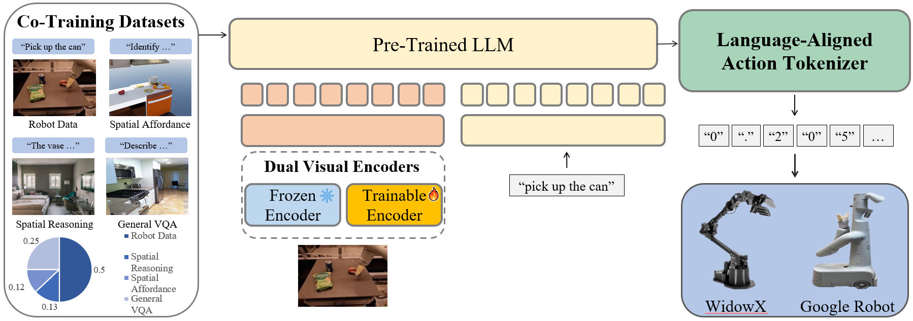
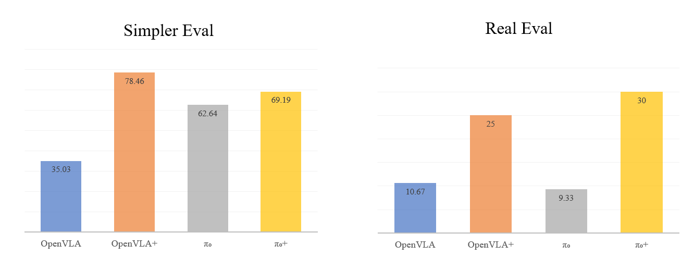

# Enhancing Generalization in Vision-Language-Action Models by Preserving Pretrained Representations

[](https://gen-vla.github.io/)
[](https://arxiv.org/abs/2509.11417)
[](https://huggingface.co/shrg7/openvla-7b)

**Shresth Grover<sup>1\*</sup>, Akshay Gopalkrishnan<sup>1\*</sup>, Bo Ai<sup>1</sup>, Henrik I. Christensen<sup>1</sup>, Hao Su<sup>1,2</sup>, Xuanlin Li<sup>2</sup>**

<sup>1</sup>UC San Diego, <sup>2</sup>Hillbot
<sup>*</sup>Equal contribution

## 📆 Updates

<!--  **September 28, 2025**: Created the repository and released the OpenVLA+ HuggingFace model! Check it out [here](https://huggingface.co/shrg7/openvla-7b). Training and code to be released soon. -->
## 🧠 Method


Our framework is built on **three key ideas** to prevent representation degradation:

1. **Partially-Frozen Visual Encoders**  
   We use two encoders—one **frozen** to preserve robust, pretrained VLM features and one **trainable** to adapt to the specific robot task.

2. **String-Based Action Tokenizer**  
   We represent continuous robot actions as **strings**, unifying them with the **text-based pretraining** of the language model.

3. **Co-Training Strategy**  
   We mix **robot demonstration data** with **vision-language datasets** emphasizing spatial reasoning.  
   This prevents the model from **overfitting to robot-specific data** and enhances its **generalization capabilities**.


## 📈 Results Overview
<p align="center">
  
</p>

We evaluate our models on two benchmarks: SimplerEnv and Real eval

Across both settings, our models — **OpenVLA+** and **π₀+** — consistently outperform their respective baselines.  
In **Simpler Eval**, our design choices (dual encoder, string tokenizer, co-training) yield up to **40% improvement** over baseline VLAs.  
In **Real Eval**, **π₀+** achieves a **success rate of 30**, marking a **three-fold improvement** over its baseline.  

These results demonstrate that our **data and architectural strategies** substantially enhance **generalization** and **robustness**, enabling reliable task execution even under real-world variability.


---

## 🤗 Model Weights

| Model | HuggingFace |
| --- | --- |
| **OpenVLA+ (7B)** | [shrg7/openvla-7b](https://huggingface.co/shrg7/openvla-7b) |

Load directly via `transformers` AutoClasses — see [Inference](#-inference) for a full example:

```python
from transformers import AutoModelForVision2Seq, AutoProcessor
processor = AutoProcessor.from_pretrained("shrg7/openvla-7b", trust_remote_code=True)
vla = AutoModelForVision2Seq.from_pretrained("shrg7/openvla-7b", trust_remote_code=True)
```

---

## 🚀 Installation

This repository was developed against Python 3.10 and PyTorch 2.2.* (CUDA toolkit ≥ 11.0 for BF16). Pinned versions:
PyTorch 2.2.0, torchvision 0.17.0, transformers 4.40.1, tokenizers 0.19.1, timm 0.9.10, flash-attn 2.5.5.

Install PyTorch first ([instructions](https://pytorch.org/get-started/locally/)) and then this package:

```bash
git clone https://github.com/<your-org>/vla-plus.git
cd vla-plus
pip install -e .

# Training additionally requires Flash-Attention 2
pip install packaging ninja
ninja --version; echo $?          # should print 0
pip install "flash-attn==2.5.5" --no-build-isolation
```

> If you only want to run inference, the lightweight install in [Inference](#-inference) is sufficient.

---

## 📦 Data Processing

Training uses datasets from the [Open X-Embodiment (OXE) collection](https://robotics-transformer-x.github.io/) in
[RLDS format](https://github.com/google-research/rlds). See
[`prismatic/vla/datasets/rlds/oxe/mixtures.py`](prismatic/vla/datasets/rlds/oxe/mixtures.py) for the full list of
component datasets and mixture weights.

### 1. Download and convert OXE data to RLDS

We follow the standard OXE prep pipeline. Use
[`prepare_open_x.sh`](https://github.com/moojink/rlds_dataset_mod/blob/main/prepare_open_x.sh) to download and resize
component datasets into a single directory (referred to below as `<DATA_ROOT>`):

```bash
# Each RLDS dataset lives under <DATA_ROOT>/<dataset_name>/<version>/...
ls <DATA_ROOT>
# e.g.  bridge_orig/  rt_1/  fractal20220817_data/  ...
```

> **Important — BridgeData V2**: the copy in OXE is stale. Download from the
> [official mirror](https://rail.eecs.berkeley.edu/datasets/bridge_release/data/tfds/bridge_dataset/) and place it under
> `bridge_orig/`. Replace any reference to `bridge` in the OXE code with `bridge_orig`.

### 2. (Optional) Add new datasets

To register a new RLDS dataset:

1. Add an entry to `prismatic/vla/datasets/rlds/oxe/configs.py` describing observation/action keys.
2. Add a transform in `prismatic/vla/datasets/rlds/oxe/transforms.py` mapping raw fields to the canonical
   `{observation, action, language_instruction}` schema.
3. Add the dataset (with weight) to the desired mixture in
   `prismatic/vla/datasets/rlds/oxe/mixtures.py`.

### 3. Cache dataset statistics

Statistics (action mean/std, q01/q99 for un-normalization) are computed automatically on first run and saved alongside
the run directory (`dataset_statistics.json`). For inference, pass the matching `unnorm_key` so actions are
de-normalized correctly.

---

## 🏋️ Training

### Full pretraining (FSDP)

The entry point is [`vla-scripts/train.py`](vla-scripts/train.py). Configurations are dataclasses registered in
[`prismatic/conf/vla.py`](prismatic/conf/vla.py); pick one with `--vla.type`.

Single-node, 8-GPU launch via the provided convenience script:

```bash
bash vla-scripts/train_8gpus.sh \
  exp_name=prism-dinosiglip-224px+mx-rt_1
```

Or invoke `torchrun` directly:

```bash
torchrun --standalone --nnodes 1 --nproc-per-node 8 vla-scripts/train.py \
  --vla.type "prism-dinosiglip-224px+mx-bridge" \
  --data_root_dir <DATA_ROOT> \
  --run_root_dir <RUNS_DIR> \
  --wandb_project "<PROJECT>" \
  --wandb_entity "<ENTITY>"
```

Multi-node (2×8 GPUs) via [`vla-scripts/train_16gpus.sh`](vla-scripts/train_16gpus.sh) — set `MASTER_ADDR`,
`MASTER_PORT`, and `NODE_RANK` on each node (or rely on your scheduler to set them):

```bash
MASTER_ADDR=<head_node> MASTER_PORT=29500 NODE_RANK=<0|1> \
  bash vla-scripts/train_16gpus.sh exp_name=prism-dinosiglip-224px+mx-rt_1
```

### Resuming a run

```bash
torchrun --standalone --nnodes 1 --nproc-per-node 8 vla-scripts/train.py \
  --vla.type "prism-dinosiglip-224px+mx-bridge" \
  --pretrained_checkpoint <PATH/TO/checkpoint.pt> \
  --is_resume True \
  --resume_step <STEP> \
  --resume_epoch <EPOCH> \
  --data_root_dir <DATA_ROOT> \
  --run_root_dir <RUNS_DIR>
```

### LoRA fine-tuning

[`vla-scripts/finetune.py`](vla-scripts/finetune.py) loads an existing OpenVLA checkpoint from the HuggingFace Hub
(or a local path) and fine-tunes with LoRA. Approx. memory footprint: bsz 12 on one 48 GB GPU, bsz 24 on one 80 GB GPU.

```bash
pip install peft==0.11.1

torchrun --standalone --nnodes 1 --nproc-per-node 8 vla-scripts/finetune.py \
  --vla_path "openvla/openvla-7b" \
  --data_root_dir <DATA_ROOT> \
  --dataset_name <RLDS_DATASET_NAME> \
  --run_root_dir <RUNS_DIR> \
  --adapter_tmp_dir <ADAPTER_TMP_DIR> \
  --use_lora True
```

After training, LoRA weights are merged into the base model and written to `<RUNS_DIR>/<exp_id>`.

### Known issues

- `FileNotFoundError: ... fractal20220817_data/0.1.0/dataset_info.json` →
  `pip install tensorflow-datasets==4.9.3`.
- `AttributeError: 'DLataset' object has no attribute 'traj_map'` →
  `pip install --no-deps --force-reinstall git+https://github.com/kvablack/dlimp@5edaa4691567873d495633f2708982b42edf1972`.

---

## 🔮 Inference

### HuggingFace AutoClass (minimal deps)

```bash
pip install -r requirements-min.txt
```

```python
from transformers import AutoModelForVision2Seq, AutoProcessor
from PIL import Image
import torch

processor = AutoProcessor.from_pretrained("shrg7/openvla-7b", trust_remote_code=True)
vla = AutoModelForVision2Seq.from_pretrained(
    "shrg7/openvla-7b",
    attn_implementation="flash_attention_2",   # optional, requires flash-attn
    torch_dtype=torch.bfloat16,
    low_cpu_mem_usage=True,
    trust_remote_code=True,
).to("cuda:0")

image: Image.Image = ...                       # H×W×3 RGB
prompt = "In: What action should the robot take to {pick up the red block}?\nOut:"

inputs = processor(prompt, image).to("cuda:0", dtype=torch.bfloat16)
action = vla.predict_action(**inputs, unnorm_key="bridge_orig", do_sample=False)
# action is a 7-DoF vector — pass to your controller
```

Set `unnorm_key` to match the dataset the model was trained on (e.g. `bridge_orig`, `rt_1`). The available keys come
from `dataset_statistics.json` in the checkpoint.

### REST server / client

`vla-scripts/deploy.py` exposes a FastAPI server that wraps the HF model:

```bash
pip install uvicorn fastapi json-numpy
python vla-scripts/deploy.py \
  --openvla_path shrg7/openvla-7b \
  --host 0.0.0.0 --port 8000
```

Client:

```python
import requests, json_numpy, numpy as np
json_numpy.patch()

action = requests.post(
    "http://0.0.0.0:8000/act",
    json={"image": np.zeros((256, 256, 3), dtype=np.uint8), "instruction": "do something"},
).json()
```

---

## 🗂️ Repository Structure

- `prismatic/` — package source: model loading, training strategies, VLA config registry, RLDS data pipeline.
- `vla-scripts/` — training (`train.py`), LoRA fine-tuning (`finetune.py`), REST deploy (`deploy.py`), and launcher
  shell scripts (`train_8gpus.sh`, `train_16gpus.sh`).
- `scripts/` — base prismatic-vlms utilities for VLM pretraining / generation (not required for VLA training).
- `pyproject.toml` — package config and dependencies.
- `figures/` — paper figures.

---

## 🙏 Acknowledgements

This codebase is built on top of [OpenVLA](https://github.com/openvla/openvla) and
[Prismatic VLMs](https://github.com/TRI-ML/prismatic-vlms).

## 📝 Citation

```bibtex
@article{grover2025enhancing,
  title={Enhancing Generalization in Vision-Language-Action Models by Preserving Pretrained Representations},
  author={Grover, Shresth and Gopalkrishnan, Akshay and Ai, Bo and Christensen, Henrik I and Su, Hao and Li, Xuanlin},
  journal={arXiv preprint arXiv:2509.11417},
  year={2025}
}
```
