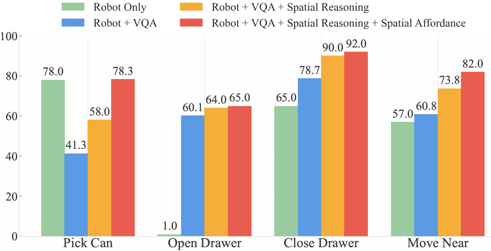

# Enhancing Generalization in Vision-Language-Action Models by Preserving Pretrained Representations

[](https://gen-vla.github.io/)
[](https://arxiv.org/abs/2509.11417)
[](https://huggingface.co/shrg7/openvla-7b)

**Shresth Grover<sup>1*</sup>, Akshay Gopalkrishnan<sup>1*</sup>, Bo Ai<sup>1</sup>, Henrik I. Christensen<sup>1</sup>, Hao Su<sup>1,2</sup>, Xuanlin Li<sup>2</sup>**

<sup>1</sup>UC San Diego, <sup>2</sup>Hillbot
<sup>*</sup>Equal contribution

## 📆 Updates

- **September 28, 2025**: CreateReleased the HuggingFace model! Check it out [here](https://huggingface.co/shrg7/openvla-7b).

## 📊 Results




## 📝 Citation

```bibtex
@article{grover2025enhancing,
  title={Enhancing Generalization in Vision-Language-Action Models by Preserving Pretrained Representations},
  author={Grover, Shresth and Gopalkrishnan, Akshay and Ai, Bo and Christensen, Henrik I and Su, Hao and Li, Xuanlin},
  journal={arXiv preprint arXiv:2509.11417},
  year={2025}
}
```
